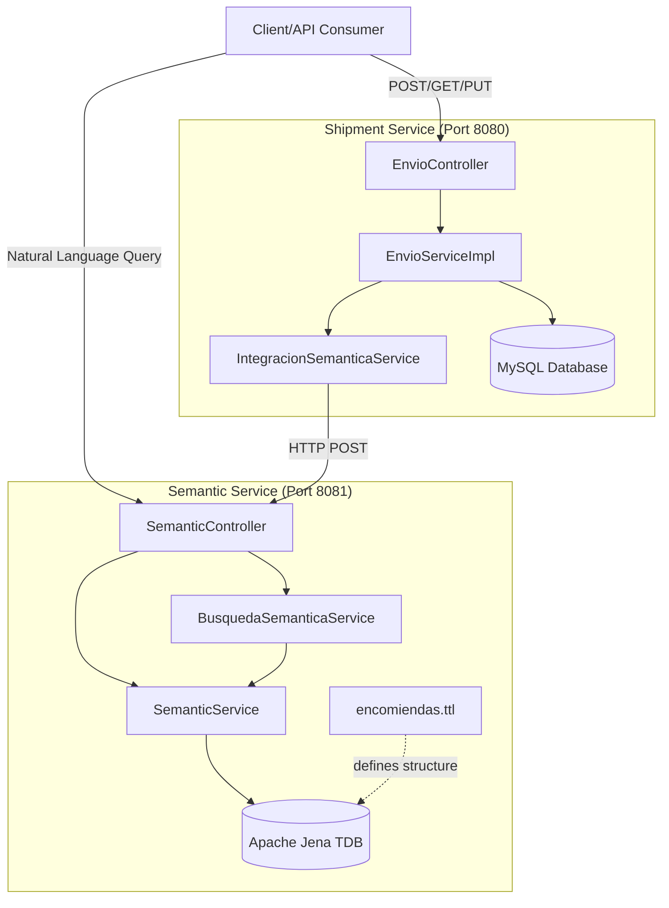

The semantic web package shipping system is built using a microservices architecture with two main services that communicate via REST APIs.

## Architecture Overview



## Microservices

### 1. Shipment Service (`svc-envio-encomienda`)

**Port:** 8080  
**Technology:** Spring Boot + MySQL + JPA/Hibernate

<Note>
  This service handles all CRUD operations for shipments, clients, and branches (sucursales).
</Note>

**Key Components:**

- **Controllers**: REST API endpoints
  - `EnvioController` (svc-envio-encomienda/src/main/java/org/jchilon3mas/springcloud/svc/envio/encomienda/web/EnvioController.java:19)
  - `ClienteController`
  - `SucursalController`

- **Services**: Business logic
  - `EnvioServiceImpl` (svc-envio-encomienda/src/main/java/org/jchilon3mas/springcloud/svc/envio/encomienda/servicios/Impl/EnvioServiceImpl.java:32)
  - Handles state transitions
  - Validates business rules

- **Entities**:
  - `Envio` (svc-envio-encomienda/src/main/java/org/jchilon3mas/springcloud/svc/envio/encomienda/entidades/Envio.java:17)
  - `Cliente`
  - `Encomienda`
  - `Sucursal`

- **Integration Service**: 
  - `IntegracionSemanticaService` sends shipment data to semantic service automatically

**Configuration:**

```properties
# application.properties
spring.application.name=svc-envio-encomienda
server.port=8080
spring.datasource.url=jdbc:mysql://localhost:3306/bd_envio_encomienda

# Semantic service endpoint
microservicio.semantica.url=http://localhost:8081/api/v1/grafo
```

### 2. Semantic Service (`svc-web-semantica`)

**Port:** 8081  
**Technology:** Spring Boot + Apache Jena + OWL/RDF

<Note>
  This service manages the semantic knowledge graph and provides natural language search capabilities.
</Note>

**Key Components:**

- **Controller**: `SemanticController` (svc-web-semantica/src/main/java/org/jchilon3mas/springcloud/svc/web/semantica/svc_web_semantica/controllers/SemanticController.java:14)

- **Services**:
  - `SemanticService`: Manages RDF triples, executes SPARQL queries
  - `BusquedaSemanticaService` (svc-web-semantica/src/main/java/org/jchilon3mas/springcloud/svc/web/semantica/svc_web_semantica/services/BusquedaSemanticaService.java:18): Translates natural language to SPARQL

- **Ontology**: `encomiendas.ttl` defines the semantic structure

- **Storage**: Apache Jena TDB (file-based RDF database)

**Configuration:**

```properties
# application.properties
spring.application.name=web-semantica
server.port=8081
jena.tdb.directory=tdb_data
```

## Data Flow

### Creating a Shipment

<Steps>
  <Step title="Client sends POST request">
    Request to `POST /api/v1/envios` with shipment details
  </Step>

  <Step title="Controller validates and delegates">
    `EnvioController` receives request and calls `EnvioServiceImpl.registrarEnvio()`
  </Step>

  <Step title="Business logic execution">
    - Validates client exists
    - Validates origin/destination branches
    - Generates tracking code: `ENV-{timestamp}`
    - Generates 4-digit delivery password
    - Sets initial state: `PENDIENTE`
  </Step>

  <Step title="Save to MySQL">
    Entity saved via JPA repository
  </Step>

  <Step title="Automatic synchronization">
    `IntegracionSemanticaService.notificarNuevoEnvio()` sends shipment data to semantic service:

    ```java
    // From EnvioServiceImpl.java:121
    Envio envioGuardado = envioRepository.save(nuevoEnvio);
    integracionSemanticaService.notificarNuevoEnvio(envioGuardado);
    return mapper.deEnvio(envioGuardado);
    ```
  </Step>

  <Step title="Convert to RDF triples">
    Semantic service receives data at `POST /api/v1/grafo/sincronizar-envio` and creates RDF triples based on the ontology:

    ```turtle
    <http://www.encomiendas.com/cliente/12345678> a enc:Cliente ;
        enc:tieneNombre "Juan Pérez" ;
        enc:tieneDni "12345678" ;
        enc:realizaEnvio <http://www.encomiendas.com/envio/ENV-1234567890> .

    <http://www.encomiendas.com/envio/ENV-1234567890> a enc:Envio ;
        enc:codigoSeguimiento "ENV-1234567890" ;
        enc:tieneEstado "PENDIENTE" ;
        enc:contienePaquete "Laptop Dell XPS 15" ;
        enc:tienePesoKg "2.5"^^xsd:decimal .
    ```
  </Step>

  <Step title="Store in TDB">
    RDF triples stored in Apache Jena TDB for querying
  </Step>
</Steps>

### Semantic Search Query

<Steps>
  <Step title="Client sends natural language query">
    Request to `GET /api/v1/grafo/buscar?texto=envios pendientes`
  </Step>

  <Step title="Natural language processing">
    `BusquedaSemanticaService.procesarLenguajeNatural()` (svc-web-semantica/src/main/java/org/jchilon3mas/springcloud/svc/web/semantica/svc_web_semantica/services/BusquedaSemanticaService.java:33) extracts parameters:

    - **States**: pendiente, en tránsito, entregado, cancelado, disponible
    - **Dates**: "hoy", "ayer", "esta semana", "DD/MM/YYYY", date ranges
    - **Weight**: "entre 2 y 5 kg", "más de 10 kg"
    - **Cities**: Lima, Cusco, Arequipa, etc.
    - **DNI**: 8-digit patterns
    - **Phone**: 9-digit patterns
    - **Tracking codes**: ENV-xxxxxxxxxx
    - **Vehicle plates**: ABC-123 format
  </Step>

  <Step title="SPARQL query construction">
    Constructs SPARQL query based on extracted parameters:

    ```sparql
    PREFIX enc: <http://www.encomiendas.com/ontologia#>
    PREFIX xsd: <http://www.w3.org/2001/XMLSchema#>

    SELECT ?codigo ?nombreRemitente ?estado ?peso
    WHERE {
        ?clienteURI enc:realizaEnvio ?envioURI .
        ?clienteURI enc:tieneNombre ?nombreRemitente .
        ?envioURI enc:tieneEstado ?estado .
        ?envioURI enc:codigoSeguimiento ?codigo .
        OPTIONAL { ?envioURI enc:tienePesoKg ?peso }
        FILTER (?estado = "PENDIENTE") .
    }
    ```
  </Step>

  <Step title="Execute against TDB">
    `SemanticService.ejecutarConsultaSparql()` runs query against Apache Jena TDB
  </Step>

  <Step title="Return results">
    Results returned as JSON array of maps with shipment details
  </Step>
</Steps>

## Communication Patterns

### Synchronous REST Communication

The shipment service communicates with the semantic service via HTTP:

```java
@Value("${microservicio.semantica.url}")
private String semanticaUrl;

// HTTP POST to sync shipment data
restTemplate.postForEntity(
    semanticaUrl + "/sincronizar-envio",
    envioSemanticoDTO,
    String.class
);
```

<Warning>
  If the semantic service is down, shipments will still be saved to MySQL but won't be searchable semantically until synchronized.
</Warning>

### Manual Synchronization

You can manually sync all shipments:

```bash
curl -X POST http://localhost:8080/api/v1/envios/sincronizar-todos
```

This is useful for:
- Initial setup with existing data
- Recovery after semantic service downtime
- Testing and development

## Scalability Considerations

### Current Architecture

- **Single instance** of each service
- **File-based** RDF storage (TDB)
- **Synchronous** communication

### Future Improvements

<CardGroup cols={2}>
  <Card title="Asynchronous Messaging" icon="message">
    Replace REST calls with message queue (RabbitMQ, Kafka) for better decoupling and reliability
  </Card>
  <Card title="Service Discovery" icon="compass">
    Implement Eureka or Consul for dynamic service registration
  </Card>
  <Card title="API Gateway" icon="door-open">
    Add Spring Cloud Gateway for unified entry point
  </Card>
  <Card title="Distributed TDB" icon="database">
    Use Apache Jena Fuseki server for distributed RDF storage
  </Card>
</CardGroup>

## Technology Stack

| Component | Technology | Purpose |
|-----------|------------|----------|
| **Framework** | Spring Boot 3.x | Microservices foundation |
| **Database** | MySQL 8.0+ | Relational data storage |
| **ORM** | JPA/Hibernate | Object-relational mapping |
| **RDF Store** | Apache Jena TDB | Triple store for semantic data |
| **Query Language** | SPARQL | Semantic graph queries |
| **Ontology** | OWL 2 | Knowledge representation |
| **HTTP Client** | RestTemplate | Inter-service communication |
| **Build Tool** | Maven | Dependency management |

## Next Steps

<CardGroup cols={2}>
  <Card title="Semantic Web Concepts" icon="brain" href="/concepts/semantic-web">
    Learn about RDF, OWL, and semantic technologies
  </Card>
  <Card title="Ontology Structure" icon="sitemap" href="/concepts/ontology">
    Explore the encomiendas.ttl ontology
  </Card>
</CardGroup>