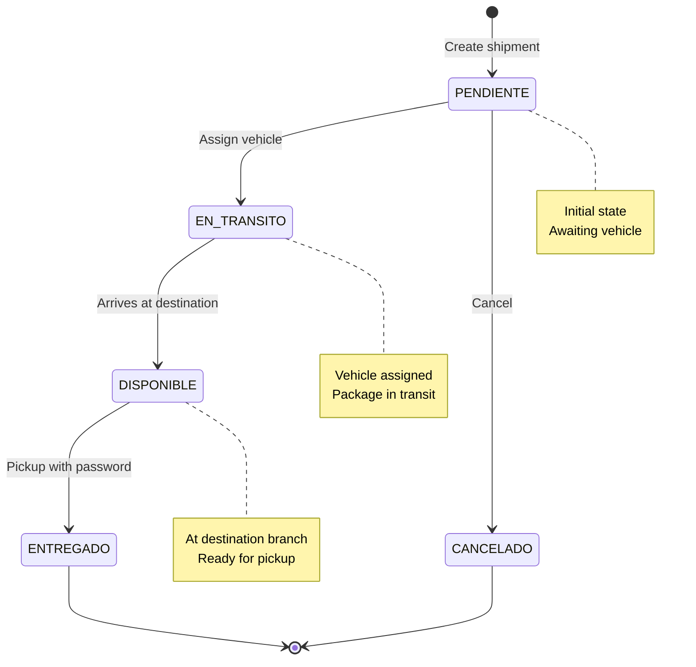
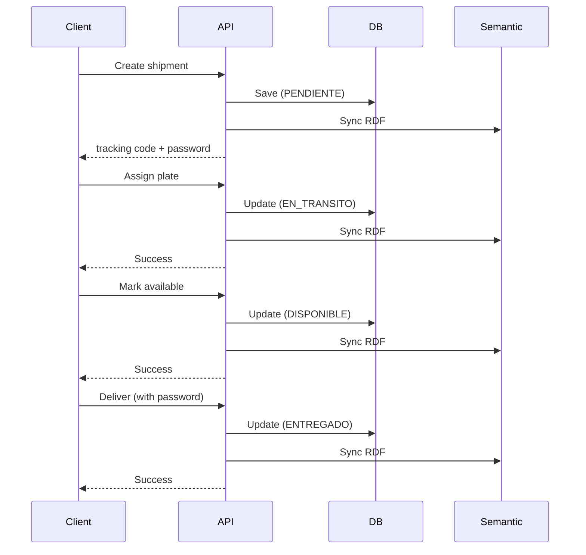
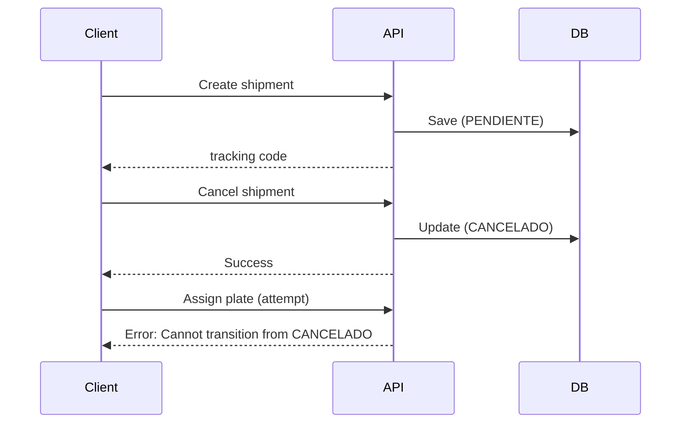

Every shipment in the system follows a defined lifecycle with five possible states. Understanding these states and their transitions is crucial for managing shipments correctly.

## Shipment States

The system defines five states in the `EstadoEnvio` enum (svc-envio-encomienda/src/main/java/org/jchilon3mas/springcloud/svc/envio/encomienda/enums/EstadoEnvio.java:3):

```java
public enum EstadoEnvio {
    PENDIENTE,
    EN_TRANSITO,
    DISPONIBLE,
    ENTREGADO,
    CANCELADO
}
```

### State Definitions

<AccordionGroup>
  <Accordion title="PENDIENTE (Pending)" icon="clock">
    **Initial state** when a shipment is created.

    **Characteristics:**
    - Awaiting vehicle assignment
    - Can be canceled
    - No tracking code assigned yet (auto-generated on creation)
    - 4-digit delivery password created

    **Example:**
    ```json
    {
      "id": 1,
      "codigoSeguimiento": "ENV-1710334200000",
      "estado": "PENDIENTE",
      "fechaEnvio": "2026-03-09T10:30:00",
      "placa": null
    }
    ```

    **Available Actions:**
    - Assign vehicle plate (transitions to EN_TRANSITO)
    - Cancel shipment (transitions to CANCELADO)
  </Accordion>

  <Accordion title="EN_TRANSITO (In Transit)" icon="truck">
    **Shipment is assigned to a vehicle and in transit** to destination.

    **Characteristics:**
    - Vehicle plate assigned
    - Cannot be canceled
    - Package is physically moving between branches

    **Example:**
    ```json
    {
      "id": 1,
      "codigoSeguimiento": "ENV-1710334200000",
      "estado": "EN_TRANSITO",
      "placa": "ABC-123",
      "sucursalOrigen": "Cajamarca Centro",
      "sucursalDestino": "Lima Miraflores"
    }
    ```

    **Available Actions:**
    - Mark as available for pickup (transitions to DISPONIBLE)
  </Accordion>

  <Accordion title="DISPONIBLE (Available for Pickup)" icon="box">
    **Package arrived at destination branch** and ready for recipient pickup.

    **Characteristics:**
    - Physically at destination branch
    - Recipient can pick up with tracking code + password
    - Waiting for final delivery

    **Example:**
    ```json
    {
      "id": 1,
      "codigoSeguimiento": "ENV-1710334200000",
      "estado": "DISPONIBLE",
      "sucursalDestino": "Lima Miraflores",
      "nombreDestinatario": "María García",
      "dniDestinatario": "87654321"
    }
    ```

    **Available Actions:**
    - Deliver package (transitions to ENTREGADO)
  </Accordion>

  <Accordion title="ENTREGADO (Delivered)" icon="check-circle">
    **Package successfully delivered** to recipient.

    **Characteristics:**
    - Delivery password validated
    - `fechaEntrega` timestamp recorded
    - Final successful state
    - No further transitions possible

    **Example:**
    ```json
    {
      "id": 1,
      "codigoSeguimiento": "ENV-1710334200000",
      "estado": "ENTREGADO",
      "fechaEnvio": "2026-03-09T10:30:00",
      "fechaEntrega": "2026-03-10T14:20:00"
    }
    ```

    **Available Actions:**
    - None (terminal state)
  </Accordion>

  <Accordion title="CANCELADO (Canceled)" icon="circle-xmark">
    **Shipment canceled** before entering transit.

    **Characteristics:**
    - Only possible from PENDIENTE state
    - Cannot be reversed
    - Typically due to sender request or payment issues

    **Example:**
    ```json
    {
      "id": 1,
      "codigoSeguimiento": "ENV-1710334200000",
      "estado": "CANCELADO",
      "fechaEnvio": "2026-03-09T10:30:00"
    }
    ```

    **Available Actions:**
    - None (terminal state)
  </Accordion>
</AccordionGroup>

## State Transition Diagram



## Allowed Transitions

The system enforces strict state transition rules in `EnvioServiceImpl` (svc-envio-encomienda/src/main/java/org/jchilon3mas/springcloud/svc/envio/encomienda/servicios/Impl/EnvioServiceImpl.java:292):

```java
private void validarTransicionEstado(EstadoEnvio actual, EstadoEnvio nuevo) {
    boolean permitida = switch (actual) {
        case PENDIENTE   -> (nuevo == EstadoEnvio.EN_TRANSITO || nuevo == EstadoEnvio.CANCELADO);
        case EN_TRANSITO -> (nuevo == EstadoEnvio.DISPONIBLE);
        case DISPONIBLE  -> (nuevo == EstadoEnvio.ENTREGADO);
        default          -> false;
    };
    if (!permitida)
        throw new IllegalStateException("Flujo inválido: " + actual + " → " + nuevo);
}
```

### Transition Table

| From State | To State | Allowed | Triggered By | API Endpoint |
|------------|----------|---------|--------------|-------------|
| PENDIENTE | EN_TRANSITO | ✅ Yes | Assign vehicle plate | `POST /api/v1/envios/asignar-placa` |
| PENDIENTE | CANCELADO | ✅ Yes | Cancel request | `PUT /api/v1/envios/{id}/cancelar` |
| EN_TRANSITO | DISPONIBLE | ✅ Yes | Arrives at branch | `PUT /api/v1/envios/{id}/disponible` |
| DISPONIBLE | ENTREGADO | ✅ Yes | Recipient pickup | `POST /api/v1/envios/retirar` |
| EN_TRANSITO | CANCELADO | ❌ No | - | - |
| DISPONIBLE | CANCELADO | ❌ No | - | - |
| ENTREGADO | (any) | ❌ No | Terminal state | - |
| CANCELADO | (any) | ❌ No | Terminal state | - |

<Warning>
  Attempting an invalid transition will throw an `IllegalStateException` and return HTTP 400.
</Warning>

## State Transition APIs

### 1. Create Shipment (Initial State)

**Endpoint:** `POST /api/v1/envios`

**Initial State:** `PENDIENTE`

```bash
curl -X POST http://localhost:8080/api/v1/envios \
  -H "Content-Type: application/json" \
  -d '{
    "remitenteId": 1,
    "encomienda": {
      "descripcion": "Laptop Dell XPS 15",
      "peso": 2.5,
      "dimensiones": "40x30x10"
    },
    "nombreDestinatario": "María García",
    "dniDestinatario": "87654321",
    "sucursalOrigenId": 1,
    "sucursalDestinoId": 2,
    "precio": 35.50
  }'
```

**Response:**
```json
{
  "id": 1,
  "codigoSeguimiento": "ENV-1710334200000",
  "estado": "PENDIENTE",
  "contrasenaEntrega": "1234",
  "fechaEnvio": "2026-03-09T10:30:00"
}
```

**Code Reference:** (svc-envio-encomienda/src/main/java/org/jchilon3mas/springcloud/svc/envio/encomienda/servicios/Impl/EnvioServiceImpl.java:102)

```java
Envio nuevoEnvio = new Envio();
nuevoEnvio.setEstado(EstadoEnvio.PENDIENTE);
```

### 2. Assign Vehicle (PENDIENTE → EN_TRANSITO)

**Endpoint:** `POST /api/v1/envios/asignar-placa`

```bash
curl -X POST http://localhost:8080/api/v1/envios/asignar-placa \
  -H "Content-Type: application/json" \
  -d '{
    "envioId": 1,
    "placa": "ABC-123"
  }'
```

**Response:**
```json
{
  "mensaje": "Placa asignada exitosamente",
  "envioId": "1",
  "placa": "ABC-123",
  "nuevoEstado": "EN_TRANSITO"
}
```

**Validation Rules:**
- Shipment must be in `PENDIENTE` state
- Plate format: `ABC-123` (3-4 alphanumeric characters, hyphen, 3-4 characters)
- Plate cannot already be assigned

**Code Reference:** (svc-envio-encomienda/src/main/java/org/jchilon3mas/springcloud/svc/envio/encomienda/servicios/Impl/EnvioServiceImpl.java:162)

```java
if (envio.getEstado() != EstadoEnvio.PENDIENTE)
    throw new IllegalStateException("Solo se asigna placa a envíos PENDIENTES.");
if (!dto.getPlaca().matches("^[A-Z0-9]{3}-[A-Z0-9]{3,4}$"))
    throw new IllegalArgumentException("Formato de placa inválido (ABC-123)");

envio.setPlaca(dto.getPlaca());
envio.setEstado(EstadoEnvio.EN_TRANSITO);
```

### 3. Mark Available (EN_TRANSITO → DISPONIBLE)

**Endpoint:** `PUT /api/v1/envios/{id}/disponible`

```bash
curl -X PUT http://localhost:8080/api/v1/envios/1/disponible
```

**Response:**
```json
{
  "mensaje": "Envío marcado como DISPONIBLE para retiro",
  "envioId": "1",
  "nuevoEstado": "DISPONIBLE"
}
```

**Validation:**
- Must be in `EN_TRANSITO` state
- Typically called when package physically arrives at destination branch

**Code Reference:** (svc-envio-encomienda/src/main/java/org/jchilon3mas/springcloud/svc/envio/encomienda/servicios/Impl/EnvioServiceImpl.java:180)

```java
validarTransicionEstado(envio.getEstado(), EstadoEnvio.DISPONIBLE);
envio.setEstado(EstadoEnvio.DISPONIBLE);
```

### 4. Deliver Package (DISPONIBLE → ENTREGADO)

**Endpoint:** `POST /api/v1/envios/retirar`

```bash
curl -X POST http://localhost:8080/api/v1/envios/retirar \
  -H "Content-Type: application/json" \
  -d '{
    "codigoSeguimiento": "ENV-1710334200000",
    "contrasenaEntrega": "1234"
  }'
```

**Response:**
```json
{
  "mensaje": "Paquete entregado exitosamente",
  "codigoSeguimiento": "ENV-1710334200000"
}
```

**Validation Rules:**
- Must be in `DISPONIBLE` state
- Delivery password must match exactly (4 digits)
- Sets `fechaEntrega` to current timestamp

**Code Reference:** (svc-envio-encomienda/src/main/java/org/jchilon3mas/springcloud/svc/envio/encomienda/servicios/Impl/EnvioServiceImpl.java:191)

```java
if (envio.getEstado() != EstadoEnvio.DISPONIBLE) {
    String msg = switch (envio.getEstado()) {
        case ENTREGADO -> "El paquete ya fue entregado";
        case CANCELADO -> "El envío está cancelado";
        default        -> "El envío aún no está disponible en sucursal";
    };
    throw new IllegalStateException(msg);
}

if (!envio.getContrasenaEntrega().equals(retiroDTO.getContrasenaEntrega()))
    throw new IllegalArgumentException("Contraseña de entrega incorrecta");

envio.setEstado(EstadoEnvio.ENTREGADO);
envio.setFechaEntrega(LocalDateTime.now());
```

### 5. Cancel Shipment (PENDIENTE → CANCELADO)

**Endpoint:** `PUT /api/v1/envios/{id}/cancelar`

```bash
curl -X PUT http://localhost:8080/api/v1/envios/1/cancelar
```

**Response:**
```json
{
  "mensaje": "Envío cancelado exitosamente",
  "envioId": "1",
  "nuevoEstado": "CANCELADO"
}
```

**Validation:**
- **Only** allowed from `PENDIENTE` state
- Cannot cancel once vehicle is assigned

**Code Reference:** (svc-envio-encomienda/src/main/java/org/jchilon3mas/springcloud/svc/envio/encomienda/servicios/Impl/EnvioServiceImpl.java:148)

```java
if (envio.getEstado() != EstadoEnvio.PENDIENTE)
    throw new IllegalStateException(
        "Solo se pueden cancelar envíos PENDIENTES. Estado: " + envio.getEstado());

envio.setEstado(EstadoEnvio.CANCELADO);
```

## Semantic Synchronization

Every state change is **automatically synchronized** to the semantic graph:

```java
// After every state change
integracionSemanticaService.notificarNuevoEnvio(envio);
```

This updates the RDF triple:

```turtle
<http://www.encomiendas.com/envio/ENV-1710334200000>
    enc:tieneEstado "EN_TRANSITO" .
```

Semantic queries reflect the updated state immediately:

```bash
curl -X GET "http://localhost:8081/api/v1/grafo/buscar?texto=envios+en+transito"
```

## Common State Scenarios

### Happy Path



### Early Cancellation



### Invalid Transition Attempts

<CodeGroup>
```bash Attempt 1: Cancel after transit
curl -X PUT http://localhost:8080/api/v1/envios/1/cancelar
# Response: 400 Bad Request
# "Solo se pueden cancelar envíos PENDIENTES. Estado: EN_TRANSITO"
```

```bash Attempt 2: Skip state
curl -X POST http://localhost:8080/api/v1/envios/retirar \
  -H "Content-Type: application/json" \
  -d '{"codigoSeguimiento": "ENV-123", "contrasenaEntrega": "1234"}'
# If estado=PENDIENTE:
# Response: 400 Bad Request
# "El envío aún no está disponible en sucursal"
```

```bash Attempt 3: Deliver twice
curl -X POST http://localhost:8080/api/v1/envios/retirar \
  -d '{"codigoSeguimiento": "ENV-123", "contrasenaEntrega": "1234"}'
# If already ENTREGADO:
# Response: 400 Bad Request
# "El paquete ya fue entregado"
```
</CodeGroup>

## Tracking State History

Currently, the system only stores the **current state**. To track history, you could:

### Option 1: Query Semantic Graph by Date

Search for all shipments that changed state on a specific date:

```bash
curl -X GET "http://localhost:8081/api/v1/grafo/buscar?texto=envios+hoy"
```

### Option 2: Add State History Entity

```java
@Entity
public class EstadoHistorial {
    @Id
    @GeneratedValue
    private Long id;
    
    @ManyToOne
    private Envio envio;
    
    private EstadoEnvio estadoAnterior;
    private EstadoEnvio estadoNuevo;
    private LocalDateTime fechaCambio;
    private String comentario;
}
```

## Querying by State

### REST API

```bash
# Get all shipments by state
curl -X GET "http://localhost:8080/api/v1/envios/estado/PENDIENTE?page=0&size=10"
```

### Semantic Search

```bash
# Natural language
curl -X GET "http://localhost:8081/api/v1/grafo/buscar?texto=envios+pendientes"

# All in transit
curl -X GET "http://localhost:8081/api/v1/grafo/buscar?texto=en+transito"

# Delivered today
curl -X GET "http://localhost:8081/api/v1/grafo/buscar?texto=entregados+hoy"
```

### SPARQL Query

```sparql
PREFIX enc: <http://www.encomiendas.com/ontologia#>

SELECT ?codigo ?estado ?fechaEnvio
WHERE {
    ?envioURI enc:codigoSeguimiento ?codigo .
    ?envioURI enc:tieneEstado ?estado .
    ?envioURI enc:fechaEnvio ?fechaEnvio .
    FILTER (?estado = "DISPONIBLE")
}
```

## Best Practices

<CardGroup cols={2}>
  <Card title="Always validate state" icon="shield-check">
    Check current state before attempting transitions
  </Card>
  <Card title="Handle transition errors" icon="bug">
    Catch `IllegalStateException` and inform users clearly
  </Card>
  <Card title="Log state changes" icon="file-lines">
    Include timestamps and user info for audit trails
  </Card>
  <Card title="Notify stakeholders" icon="bell">
    Send emails/SMS on key transitions (DISPONIBLE, ENTREGADO)
  </Card>
</CardGroup>

## Next Steps

<CardGroup cols={2}>
  <Card title="Creating Shipments" icon="plus" href="/guides/creating-shipments">
    Learn to create shipments via API
  </Card>
  <Card title="Semantic Search" icon="magnifying-glass" href="/guides/semantic-search">
    Query shipments by state naturally
  </Card>
  <Card title="Setup Guide" icon="wrench" href="/guides/setup">
    Configure the system
  </Card>
  <Card title="Ontology Reference" icon="book" href="/concepts/ontology">
    How states are represented in RDF
  </Card>
</CardGroup>