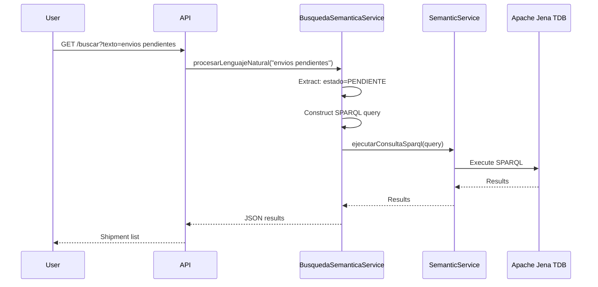

The semantic search feature allows you to query shipments using natural language instead of writing complex SQL or SPARQL queries. The system automatically translates your text into SPARQL and executes it against the knowledge graph.

## How It Works

The `BusquedaSemanticaService` (svc-web-semantica/src/main/java/org/jchilon3mas/springcloud/svc/web/semantica/svc_web_semantica/services/BusquedaSemanticaService.java:18) processes natural language:



## Basic Search

### Simple Queries

<CodeGroup>
```bash Pending shipments
curl -X GET "http://localhost:8081/api/v1/grafo/buscar?texto=envios+pendientes"
```

```bash In transit
curl -X GET "http://localhost:8081/api/v1/grafo/buscar?texto=en+transito"
```

```bash Delivered
curl -X GET "http://localhost:8081/api/v1/grafo/buscar?texto=entregados"
```

```bash Available for pickup
curl -X GET "http://localhost:8081/api/v1/grafo/buscar?texto=disponibles"
```

```bash Canceled
curl -X GET "http://localhost:8081/api/v1/grafo/buscar?texto=cancelados"
```
</CodeGroup>

### Response Format

```json
[
  {
    "codigo": "ENV-1710334200000",
    "nombreRemitente": "Juan Pérez",
    "dniRemitente": "12345678",
    "telefonoRemitente": "987654321",
    "nombreDestinatario": "María García",
    "dniDestinatario": "87654321",
    "estado": "PENDIENTE",
    "origenEn": "Cajamarca",
    "ciudadDestino": "Lima",
    "sucursalOrigen": "Sucursal Centro Cajamarca",
    "sucursalDestino": "Sucursal Miraflores Lima",
    "descripcion": "Laptop Dell XPS 15",
    "peso": "2.5",
    "precio": "35.50",
    "fechaEnvio": "2026-03-09T10:30:00",
    "fechaEntrega": null,
    "placaVehiculo": null
  }
]
```

## Search by State

The system recognizes multiple Spanish terms for each state:

### PENDIENTE (Pending)

```bash
curl -X GET "http://localhost:8081/api/v1/grafo/buscar?texto=pendientes"
curl -X GET "http://localhost:8081/api/v1/grafo/buscar?texto=esperando"
```

### EN_TRANSITO (In Transit)

```bash
curl -X GET "http://localhost:8081/api/v1/grafo/buscar?texto=en+transito"
curl -X GET "http://localhost:8081/api/v1/grafo/buscar?texto=transito"
```

### DISPONIBLE (Available)

```bash
curl -X GET "http://localhost:8081/api/v1/grafo/buscar?texto=disponibles"
curl -X GET "http://localhost:8081/api/v1/grafo/buscar?texto=listo+para+retirar"
```

### ENTREGADO (Delivered)

```bash
curl -X GET "http://localhost:8081/api/v1/grafo/buscar?texto=entregados"
```

### CANCELADO (Canceled)

```bash
curl -X GET "http://localhost:8081/api/v1/grafo/buscar?texto=cancelados"
```

## Search by Weight

### Exact Weight

```bash
curl -X GET "http://localhost:8081/api/v1/grafo/buscar?texto=2.5+kg"
curl -X GET "http://localhost:8081/api/v1/grafo/buscar?texto=5+kilos"
```

### Weight Range

```bash
curl -X GET "http://localhost:8081/api/v1/grafo/buscar?texto=entre+2+y+5+kg"
curl -X GET "http://localhost:8081/api/v1/grafo/buscar?texto=entre+10+y+20+kilos"
```

### Greater Than

```bash
curl -X GET "http://localhost:8081/api/v1/grafo/buscar?texto=mas+de+10+kg"
curl -X GET "http://localhost:8081/api/v1/grafo/buscar?texto=mayor+a+20+kg"
curl -X GET "http://localhost:8081/api/v1/grafo/buscar?texto=superior+a+15+kg"
```

### Less Than

```bash
curl -X GET "http://localhost:8081/api/v1/grafo/buscar?texto=menos+de+5+kg"
curl -X GET "http://localhost:8081/api/v1/grafo/buscar?texto=menor+a+3+kg"
curl -X GET "http://localhost:8081/api/v1/grafo/buscar?texto=inferior+a+10+kg"
```

## Search by Date

### Relative Dates

<CodeGroup>
```bash Today
curl -X GET "http://localhost:8081/api/v1/grafo/buscar?texto=envios+de+hoy"
```

```bash Yesterday
curl -X GET "http://localhost:8081/api/v1/grafo/buscar?texto=envios+de+ayer"
```

```bash This week
curl -X GET "http://localhost:8081/api/v1/grafo/buscar?texto=esta+semana"
```

```bash Last week
curl -X GET "http://localhost:8081/api/v1/grafo/buscar?texto=la+semana+pasada"
```

```bash This month
curl -X GET "http://localhost:8081/api/v1/grafo/buscar?texto=este+mes"
```

```bash Last month
curl -X GET "http://localhost:8081/api/v1/grafo/buscar?texto=el+mes+pasado"
```

```bash This year
curl -X GET "http://localhost:8081/api/v1/grafo/buscar?texto=este+año"
```

```bash Last year
curl -X GET "http://localhost:8081/api/v1/grafo/buscar?texto=el+año+pasado"
```
</CodeGroup>

### Exact Dates

```bash
# Format: DD/MM/YYYY
curl -X GET "http://localhost:8081/api/v1/grafo/buscar?texto=09/03/2026"

# ISO format: YYYY-MM-DD
curl -X GET "http://localhost:8081/api/v1/grafo/buscar?texto=2026-03-09"
```

### Month and Year

```bash
# Specific month
curl -X GET "http://localhost:8081/api/v1/grafo/buscar?texto=marzo+2026"
curl -X GET "http://localhost:8081/api/v1/grafo/buscar?texto=en+enero"

# Just year
curl -X GET "http://localhost:8081/api/v1/grafo/buscar?texto=2026"
curl -X GET "http://localhost:8081/api/v1/grafo/buscar?texto=2025"
```

### Date Ranges

```bash
# Between two dates
curl -X GET "http://localhost:8081/api/v1/grafo/buscar?texto=entre+01/03/2026+y+31/03/2026"

# From date
curl -X GET "http://localhost:8081/api/v1/grafo/buscar?texto=desde+01/03/2026"

# Until date
curl -X GET "http://localhost:8081/api/v1/grafo/buscar?texto=hasta+31/03/2026"
```

## Search by Location

### Destination City

```bash
curl -X GET "http://localhost:8081/api/v1/grafo/buscar?texto=envios+a+Lima"
curl -X GET "http://localhost:8081/api/v1/grafo/buscar?texto=destino+Cusco"
curl -X GET "http://localhost:8081/api/v1/grafo/buscar?texto=para+Arequipa"
```

### Origin City

```bash
curl -X GET "http://localhost:8081/api/v1/grafo/buscar?texto=desde+Cajamarca"
curl -X GET "http://localhost:8081/api/v1/grafo/buscar?texto=origen+Lima"
```

### Supported Cities

The system recognizes these Peruvian cities:
- Cajamarca
- Lima
- Cusco
- Arequipa
- Trujillo
- Piura
- Huanuco
- Ica
- Tacna
- Puno
- Chiclayo

## Search by Identifiers

### DNI (8 digits)

```bash
# Searches both sender and recipient DNI
curl -X GET "http://localhost:8081/api/v1/grafo/buscar?texto=12345678"
```

### Phone Number (9 digits)

```bash
curl -X GET "http://localhost:8081/api/v1/grafo/buscar?texto=987654321"
```

### Tracking Code

```bash
curl -X GET "http://localhost:8081/api/v1/grafo/buscar?texto=ENV-1710334200000"
```

### Vehicle Plate

```bash
curl -X GET "http://localhost:8081/api/v1/grafo/buscar?texto=ABC-123"
```

### Package Dimensions

```bash
curl -X GET "http://localhost:8081/api/v1/grafo/buscar?texto=40x30x10"
```

## Search by Price

```bash
curl -X GET "http://localhost:8081/api/v1/grafo/buscar?texto=35.50+soles"
curl -X GET "http://localhost:8081/api/v1/grafo/buscar?texto=s/+50"
```

## Combined Queries

Combine multiple criteria in one search:

<CodeGroup>
```bash State + Weight
curl -X GET "http://localhost:8081/api/v1/grafo/buscar?texto=pendientes+entre+2+y+5+kg"
```

```bash State + Date
curl -X GET "http://localhost:8081/api/v1/grafo/buscar?texto=entregados+hoy"
```

```bash State + Location
curl -X GET "http://localhost:8081/api/v1/grafo/buscar?texto=en+transito+a+Lima"
```

```bash Weight + Date + Location
curl -X GET "http://localhost:8081/api/v1/grafo/buscar?texto=mas+de+10+kg+esta+semana+destino+Cusco"
```

```bash Complex Query
curl -X GET "http://localhost:8081/api/v1/grafo/buscar?texto=pendientes+desde+Cajamarca+entre+2+y+8+kg+este+mes"
```
</CodeGroup>

## Free Text Search

Search in description and names:

```bash
# Search in package description
curl -X GET "http://localhost:8081/api/v1/grafo/buscar?texto=laptop"

# Search by sender name
curl -X GET "http://localhost:8081/api/v1/grafo/buscar?texto=Juan+Perez"

# Search by recipient name
curl -X GET "http://localhost:8081/api/v1/grafo/buscar?texto=Maria+Garcia"
```

## How Parameters are Extracted

The `BusquedaSemanticaService` uses regex patterns to extract parameters (svc-web-semantica/src/main/java/org/jchilon3mas/springcloud/svc/web/semantica/svc_web_semantica/services/BusquedaSemanticaService.java:56):

### Tracking Code
```java
Matcher mCod = Pattern.compile("\\benv-\\d+\\b").matcher(frase);
if (mCod.find()) { fCodigo = mCod.group(); }
```

### DNI (8 digits)
```java
Matcher mDni = Pattern.compile("(?<!\\d)(\\d{8})(?!\\d)").matcher(frase);
if (mDni.find()) { fDni = mDni.group(1); }
```

### Weight Range
```java
Matcher mPesoRango = Pattern.compile(
    "\\bentre\\s+(\\d+(\\.\\d+)?)\\s*(?:y|a)\\s*(\\d+(\\.\\d+)?)\\s*(?:kg|kilos)?\\b"
).matcher(frase);
if (mPesoRango.find()) {
    fPesoMin = mPesoRango.group(1);
    fPesoMax = mPesoRango.group(3);
}
```

### Date Relative
```java
if (Pattern.compile("\\bhoy\\b").matcher(frase).find()) {
    fFechaContenido = LocalDate.now().format(DateTimeFormatter.ISO_DATE);
} else if (Pattern.compile("\\bayer\\b").matcher(frase).find()) {
    fFechaContenido = LocalDate.now().minusDays(1).format(DateTimeFormatter.ISO_DATE);
}
```

## Generated SPARQL Examples

### Example 1: "envios pendientes"

**Extracted Parameters:**
- Estado: `PENDIENTE`

**Generated SPARQL:**
```sparql
PREFIX enc: <http://www.encomiendas.com/ontologia#>

SELECT ?codigo ?nombreRemitente ?estado ?peso
WHERE {
    ?clienteURI enc:realizaEnvio ?envioURI .
    ?clienteURI enc:tieneNombre ?nombreRemitente .
    ?envioURI enc:tieneEstado ?estado .
    ?envioURI enc:codigoSeguimiento ?codigo .
    OPTIONAL { ?envioURI enc:tienePesoKg ?peso }
    FILTER (?estado = "PENDIENTE") .
}
```

### Example 2: "entre 2 y 5 kg a Lima"

**Extracted Parameters:**
- Peso min: `2`
- Peso max: `5`
- Ciudad destino: `lima`

**Generated SPARQL:**
```sparql
PREFIX enc: <http://www.encomiendas.com/ontologia#>
PREFIX xsd: <http://www.w3.org/2001/XMLSchema#>

SELECT ?codigo ?peso ?ciudadDestino
WHERE {
    ?clienteURI enc:realizaEnvio ?envioURI .
    ?envioURI enc:codigoSeguimiento ?codigo .
    ?envioURI enc:tienePesoKg ?peso .
    ?envioURI enc:destinoEn ?ciudadDestino .
    FILTER (xsd:decimal(?peso) >= 2) .
    FILTER (xsd:decimal(?peso) <= 5) .
    FILTER (contains(lcase(?ciudadDestino), "lima")) .
}
```

### Example 3: "entregados hoy"

**Extracted Parameters:**
- Estado: `ENTREGADO`
- Fecha contenido: `2026-03-09` (today's date)

**Generated SPARQL:**
```sparql
PREFIX enc: <http://www.encomiendas.com/ontologia#>

SELECT ?codigo ?estado ?fechaEntrega
WHERE {
    ?envioURI enc:codigoSeguimiento ?codigo .
    ?envioURI enc:tieneEstado ?estado .
    ?envioURI enc:fechaEntrega ?fechaEntrega .
    FILTER (?estado = "ENTREGADO") .
    FILTER (contains(str(?fechaEntrega), "2026-03-09")) .
}
```

## Search Tips

<CardGroup cols={2}>
  <Card title="Use Spanish Terms" icon="language">
    The system is optimized for Spanish queries: "envios", "pendientes", "entre", "desde", etc.
  </Card>
  <Card title="Combine Criteria" icon="layer-group">
    You can combine multiple filters: state + weight + location + date
  </Card>
  <Card title="Case Insensitive" icon="text-size">
    Searches are case-insensitive: "Lima" = "lima" = "LIMA"
  </Card>
  <Card title="Stopwords Removed" icon="filter">
    Common words like "el", "la", "de", "que" are automatically filtered
  </Card>
</CardGroup>

## Advanced Features

### URL Encoding

When using curl, encode special characters:

```bash
# Spaces
curl -X GET "http://localhost:8081/api/v1/grafo/buscar?texto=envios+pendientes"
# or
curl -X GET "http://localhost:8081/api/v1/grafo/buscar?texto=envios%20pendientes"

# Accents
curl -X GET "http://localhost:8081/api/v1/grafo/buscar?texto=env%C3%ADos+tr%C3%A1nsito"
```

### JavaScript/Fetch

```javascript
const searchShipments = async (query) => {
  const url = new URL('http://localhost:8081/api/v1/grafo/buscar');
  url.searchParams.append('texto', query);
  
  const response = await fetch(url);
  return await response.json();
};

// Usage
const results = await searchShipments('pendientes entre 2 y 5 kg');
console.log(`Found ${results.length} shipments`);
```

### Python Requests

```python
import requests
import urllib.parse

def search_shipments(query):
    encoded_query = urllib.parse.quote(query)
    url = f"http://localhost:8081/api/v1/grafo/buscar?texto={encoded_query}"
    response = requests.get(url)
    return response.json()

# Usage
results = search_shipments("envios pendientes entre 2 y 5 kg")
for shipment in results:
    print(f"{shipment['codigo']}: {shipment['descripcion']}")
```

## Limitations

<Warning>
  **Current Limitations:**
  
  1. **Spanish Only**: The NLP is optimized for Spanish. English queries may not work.
  2. **Predefined Patterns**: Only recognizes specific patterns (weight ranges, dates, states).
  3. **No Synonyms**: Doesn't understand synonyms beyond predefined terms.
  4. **No Spelling Correction**: Typos are not auto-corrected.
  5. **Limited Reasoning**: Cannot infer "heavy" = "> 20kg" without explicit weight.
</Warning>

## Performance

- **Fast**: Searches execute in milliseconds against TDB
- **Scalable**: Can handle millions of triples
- **Indexed**: SPARQL engine uses optimized indexes

## Troubleshooting

<AccordionGroup>
  <Accordion title="No results returned">
    **Possible causes:**
    - No shipments match your criteria
    - Semantic service not synchronized with MySQL data
    - Typo in search terms

    **Solutions:**
    - Try broader search: just "pendientes"
    - Sync all shipments: `POST /api/v1/envios/sincronizar-todos`
    - Check spelling
  </Accordion>

  <Accordion title="Wrong results returned">
    **Possible causes:**
    - Free text search matching unintended fields
    - Date interpretation issue

    **Solutions:**
    - Be more specific with identifiers (DNI, tracking code)
    - Use exact date formats: DD/MM/YYYY or YYYY-MM-DD
  </Accordion>

  <Accordion title="500 Internal Server Error">
    **Possible causes:**
    - Malformed SPARQL query generated
    - TDB corruption

    **Solutions:**
    - Check semantic service logs
    - Restart semantic service
    - Rebuild TDB: delete `tdb_data/`, restart, resync
  </Accordion>
</AccordionGroup>

## Next Steps

<CardGroup cols={2}>
  <Card title="SPARQL Queries" icon="code" href="/guides/sparql-queries">
    Write custom SPARQL for advanced queries
  </Card>
  <Card title="Ontology Reference" icon="book" href="/concepts/ontology">
    Understand the semantic structure
  </Card>
  <Card title="Creating Shipments" icon="plus" href="/guides/creating-shipments">
    Create data to search
  </Card>
  <Card title="Semantic Web Concepts" icon="brain" href="/concepts/semantic-web">
    Learn the underlying technology
  </Card>
</CardGroup>